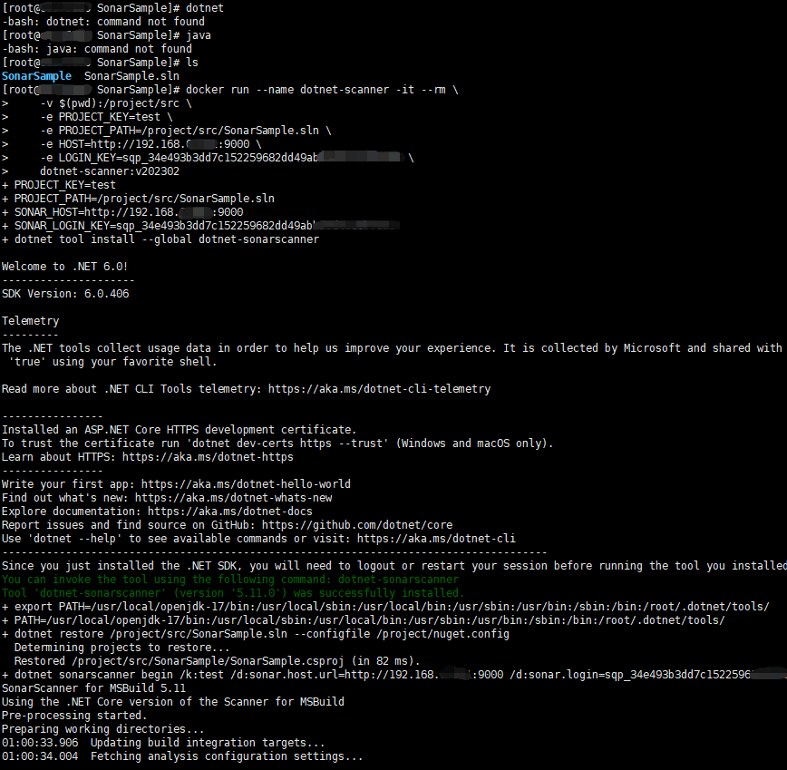
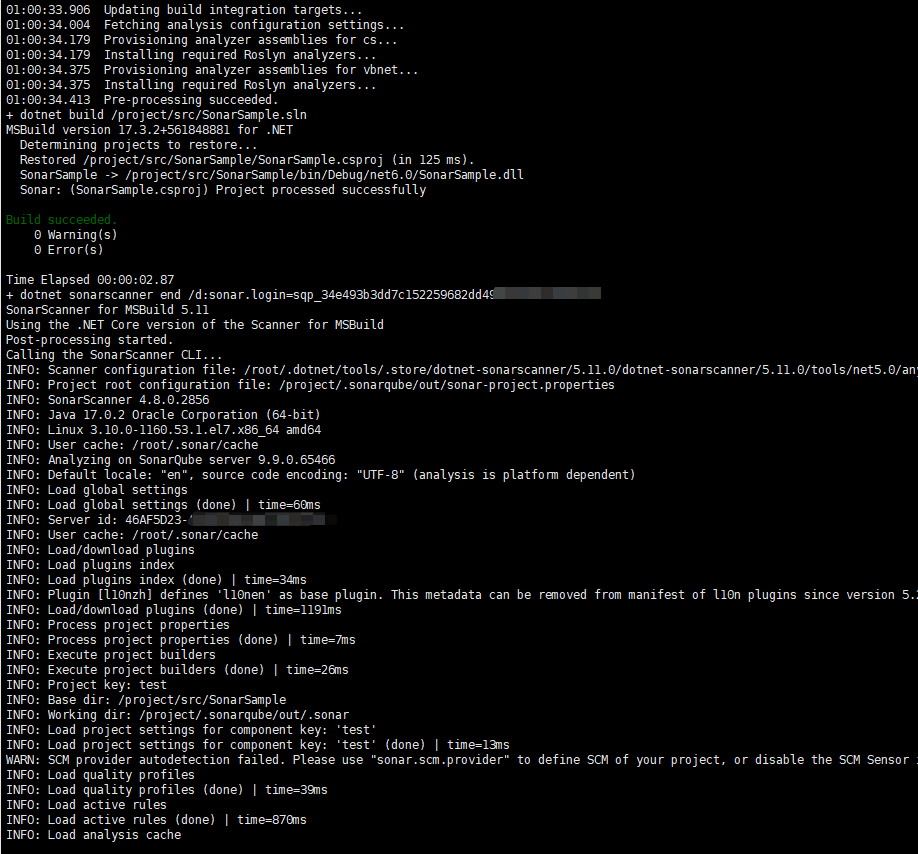
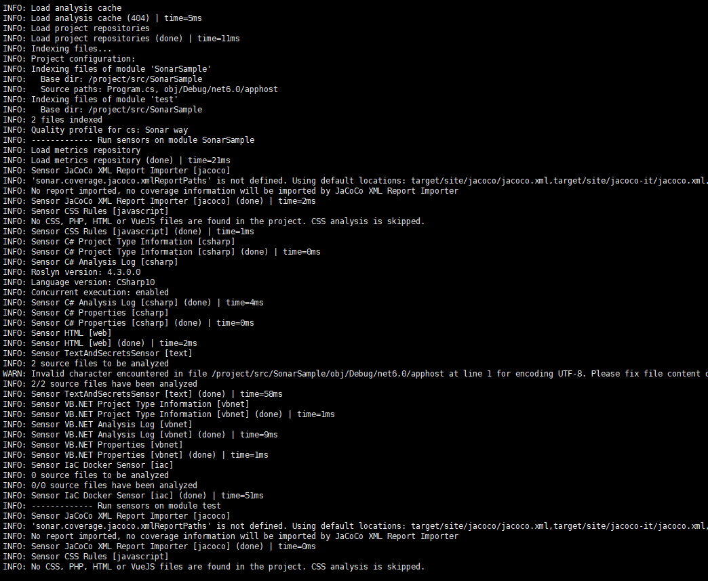
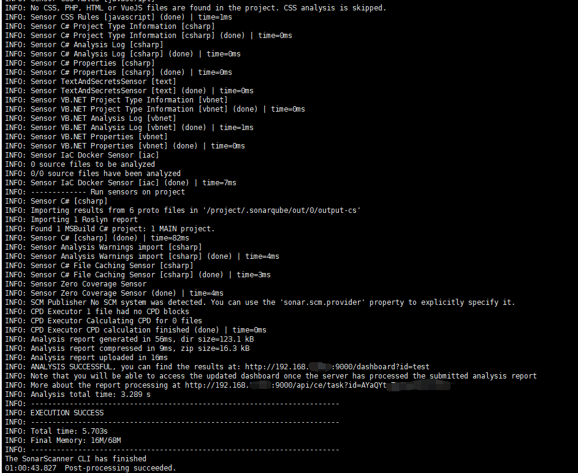
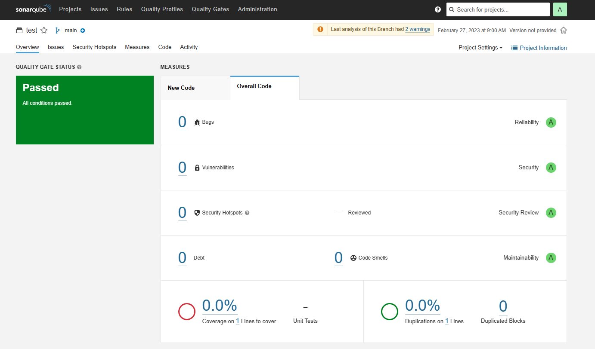
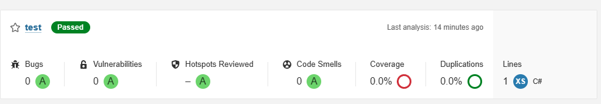

# dotnet-sonarscanner-with-docker

`dotnet-sonarscanner-with-docker` is a Dockerfile that helps to run .NET Core project with [SonarQube](https://www.sonarsource.com/).

It provider an easy way to run sonar scanner for dotnet project with docker, you do not need to install JDK and dotnet SDK on your machine.

This repository is inspired by [docker-dotnet-sonarscanner](https://github.com/burakince/docker-dotnet-sonarscanner).

## How to build

```sh
docker build -t dotnet-scanner:v202302 .
```

## How to use

```sh
docker run --name dotnet-scanner -it --rm \
    -v PUT_YOUR_PROJECT_DIR_HERE:/project/src \
    -e PROJECT_KEY=PUT_YOUR_PROJECT_KEY_HERE \
    -e PROJECT_PATH=/project/src/PUT_YOUR_PROJECT_PATH_HERE \
    -e HOST=PUT_YOUR_HOST_HERE \
    -e LOGIN_KEY=PUT_YOUR_KEY_HERE \
    dotnet-scanner:v202302
```

> NOTE: 
> 1. If you have a private NuGet feed, please update `nuget.config`;
> 2. The `Dockerfile` includes dotnet sdk 3.1 and 6.0 by default;

## More Information

### Execute Step






### Result




